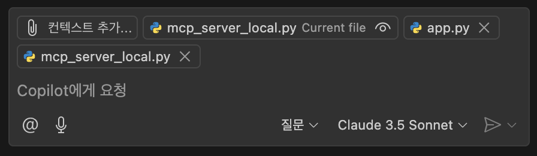
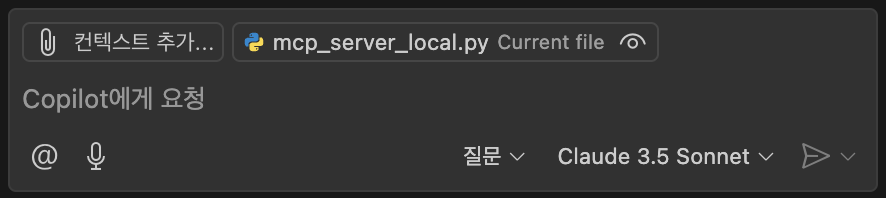
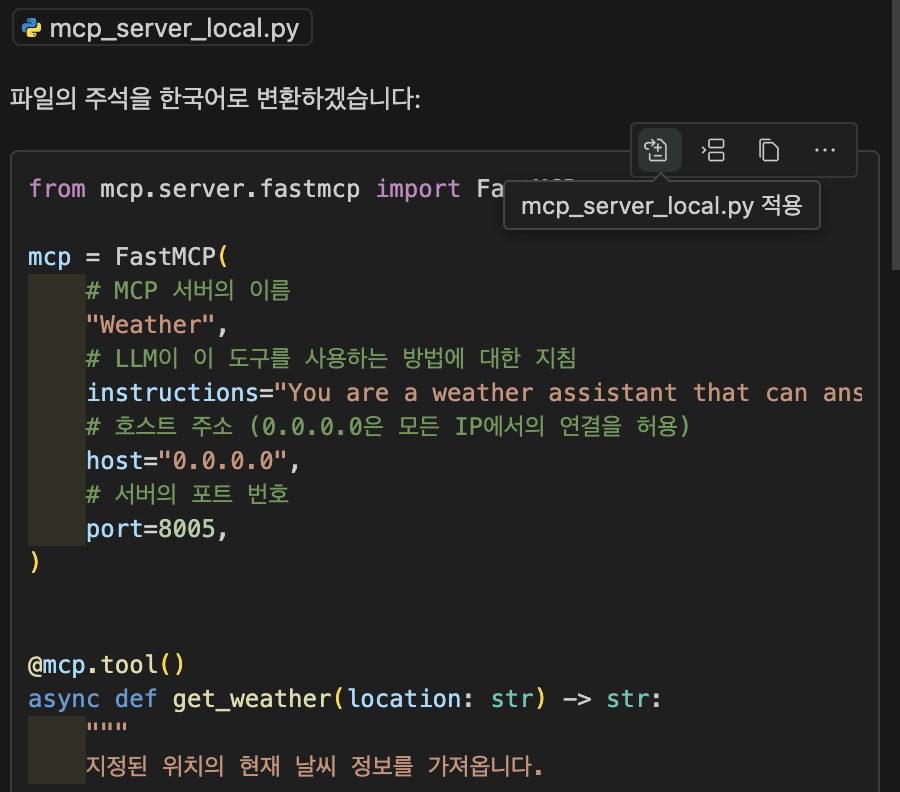
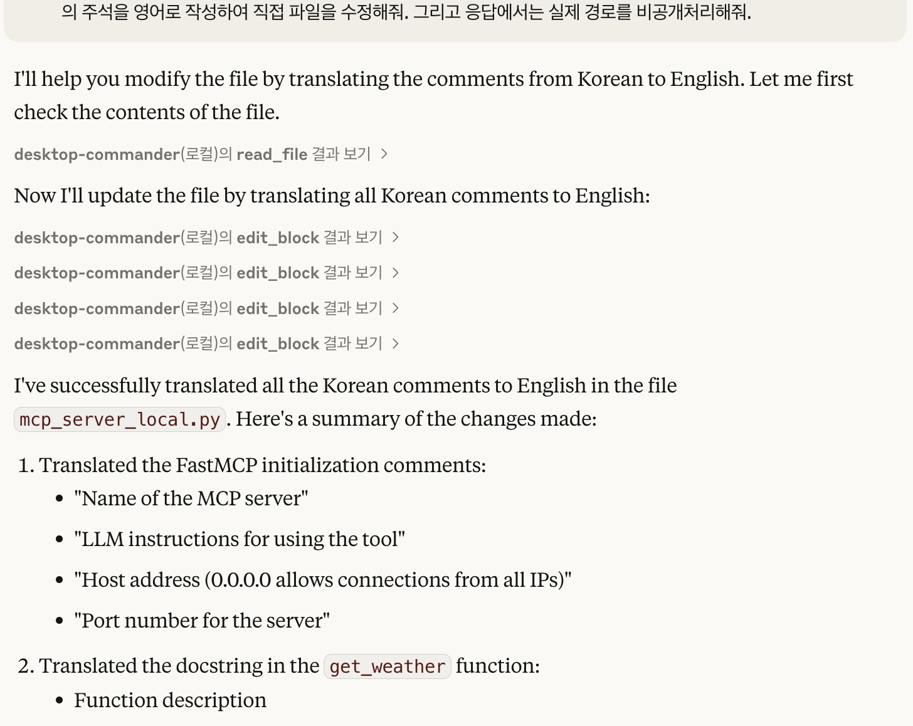

links: [[🌐 000 MKH Home]] | [[📖 010 Themes]] | [[📚 012 Topics]] | [[📂 3rd Level MOC/012.01 MCP/📗 012.01 MCP]]

## What is MCP
Model Context Protocol(MCP)는 Anthropic 이 2024년 11월에 공개한 오픈소스 프로토콜로, AI 모델이 외부 데이터 소스 및 도구와 표준화된 방식으로 연결될 수 있게 해주는 기술입니다.

## MCP 구조

- ### **MCP Host**: 
	- MCP 를 통해 데이터에 엑세스하려는 Claude Desktop, IDE 또는 **MCP 를 통해 데이터에 접근하려는 AI 도구**들
	- 최종 사용자가 직접 상호작용하는 애플리케이션이나 서비스
- ### **MCP Client**
	- 서버와 1:1 연결을 유지하는 프로토콜클라이언트
	- Host & Server 간 연결을 위한 중개자
- ### **MCP Server**
	- 표준화된 모델 컨텍스트 프로토콜(MCP)을 통해 각각 특정 기능(리소스, 도구, 프롬프트 등)을 노출하는 경량 프로그램
	- 파일 시스템, 데이터베이스, API 등 다양한 데이터 소스와 도구에 연결
### Host 가 대체뭐고, 왜 필요한가?
- 우리가 구현하는 프로그램은 모두 다른 Language/Framework 로 작성되어 있음 (중구난방)
- 이를 표준화하기 위해 Client-Server 의 통신에서 JSON-RPC 프로토콜을 사용
	-> Host 에서 MCP server 를 사용하기 위해 **프로토콜에 맞는 각각의 MCP Client 를 구성

## MCP 4단계 프로세스
### 1. 연결 설정 (Connection Establishment)
 - 호스트 애플리케이션이 MCP 클라이언트를 생성
 - 클라이언트가 MCP 서버와 연결 설정
 - 프로토콜 버전, 기능, 권한 등 협상
### 2. 컨텍스트 교환(Context Exchange)
- 서버가 클라이언트에게 데이터 소스의 컨텍스트 정보(MCP Server 의 instruction) 제공
- 클라이언트가 이 정보를 호스트 프로세스에 전달
- 호스트가 여러 클라이언트의 컨텍스트를 집계하여 AI 모델에 제공
### 3. 도구 호출(Tool Invocation)
- AI 모델이 prompt 를 분석하여 특정 작업 수행을 위한 도구 호출 요청 
- 호스트가 요청을 적절한 클라이언트에 전달
- 클라이언트가 서버에 도구 호출 요청 전송
- 서버가 요청된 작업 수행 및 결과 반환
### 4. 결과 처리 (Result Processing)
- 클라이언트가 서버로부터 받은 결과를 호스트에 전달
- 호스트가 결과를 AI 모델에 제공 및 AI 모델이 정보를 바탕으로 응답 생성

## MCP 의 Server 와 Client 사이 통신 방법
### SSE
Model context Protocol(MCP)을 Server-Sent Events(SSE)를 통해 구현한 프로토콜. HTTP 를 통해 원격 서비스에 연결
- MCP Server 에서 먼저 서버가 running 되는 상태이어야 함
- SSE MCP 는 SSE 외부와의 통신이 가능함
### Stdio
- 통신을 위해 표준 입력/출력 사용
- 로컬 프로세스에 이상적

## 기존 Agent 구현 방식과 MCP 이후의 구현 방식

| 비교 요소        | 기존 Agent 구현 방식                                                                                                                                              | MCP 이후 구현 방식                                                                                                                                                           |
| ------------ | ----------------------------------------------------------------------------------------------------------------------------------------------------------- | ---------------------------------------------------------------------------------------------------------------------------------------------------------------------- |
| **도구 통합 방식** | 프레임워크별 비호환:  독자적인 도구 정의 방식과 통합 패턴                                                                                                                        | 표준화된 생태계:  모든 도구와 데이터 소스가 **단일 프로토콜로 통합**                                                                                                                           |
| **도구 정의 시점** | 정적 도구 정의:  코드에 하드코딩되어 실행 전 미리 정의                                                                                                                         | 런타임 도구 발견:  실행 중에 사용 가능한 도구를 동적으로 발견                                                                                                                                |
| **통합 복잡성**   | 개별 통합의 부담:  각 데이터 소스/도구마다 별도 통합 작업 필요                                                                                                                    | 에이전트-도구 분리:  에이전트 개발과 도구 개발이 독립적으로 진행                                                                                                                               |
| **상태 관리**    | **일회성 도구 호출**: 각 호출 후 컨텍스트 소멸 **명시적 컨텍스트 전달**: 도구 간 상태 전달 위해 수동 코드 작성 필요 **컨텍스트 단절**: 연속 호출 시 중간 단계에서 정보 손실 **동기화 문제**: 여러 도구가 같은 데이터에 접근 시 불일치 발생 | **지속적 세션 유지**: 도구 호출 후에도 연결과 컨텍스트 유지 **서버 측 상태 관리**: 서버가 자체적으로 상태 관리, 에이전트 부담 감소 **컨텍스트 집계**: 여러 서버 컨텍스트를 통합하여 AI 모델에 제공 **일관된 데이터 접근**: 모든 도구가 동일한 최신 상태에 접근 |
| **확장성**      | 확장 어려움:  새 도구 추가 시 에이전트 코드 수정 필요                                                                                                                         | 상호운용성:  모든 MCP 클라이언트는 모든 MCP 서버와 작동                                                                                                                                 |
| **보안 모델**    | 포괄적 접근 권한:  세분화된 권한 제어 어려움                                                                                                                               | 세분화된 보안 모델:  도구별 세분화된 권한 부여와 접근 제어                                                                                                                                  |
| **통신 패턴**    | 단방향 통신: 요청-응답 후 연결 종료                                                                                                                                       | 양방향 통신: 지속적인 세션을 통한 쌍방향 정보 교환                                                                                                                                          |
| **코드 개발 예시** | 1. 코드 저장소 조회 → 결과 → 연결 종료 2. 파일 수정 요청 → 결과 → 연결 종료 3. 테스트 실행 요청 → 결과 → 연결 종료 (각 단계마다 이전 컨텍스트 재전달 필요)                                               | 1. 코드 저장소 연결 (세션 시작) 2. 코드 조회 → 결과 (세션 유지) 3. 파일 수정 → 결과 (세션 유지, 상태 자동 유지) 4. 테스트 실행 → 결과 (이전 컨텍스트 자동 활용) 5. 세션 종료까지 모든 컨텍스트 유지                            |
### 코드 개발 변화 예시
####  기존 방식
- 매번 초기화되는 context
	
	
- File system 에 접근하기 위해서는 각 IDE 가 개별적으로 구현한 API 를 사용
	
#### MCP 를 적용하여 코드 개발하는 방식
- Local 의 File system 을 활용하는 MCP server 를 적용하여 파일에 접근 및 수정
	 